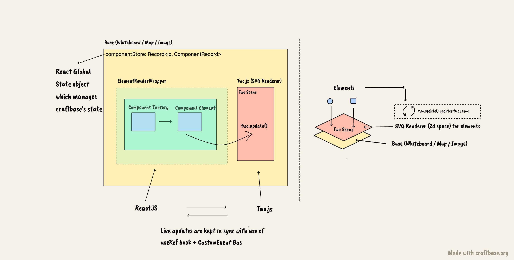

# Craftbase

A minimal online whiteboard you can open and start drawing on. No signup, no setup, no empty-state tutorial to click through — the canvas is just there waiting.

**Try it: [craftbase.org](https://craftbase.org)**

<!--
    Demo GIF goes here. Record a short loop (10–15s) of opening the canvas and
    sketching a few shapes + some pencil strokes, then drop it at the path below.
    A moving picture sells this far better than any paragraph can.
-->


## What it is

I wanted a whiteboard that gets out of the way. Most tools make you sign in, pick a template, or learn their toolbar before you can think. Craftbase opens straight onto a blank canvas — you draw shapes, scribble with the pencil, drop some text, connect things with arrows, and that's the whole pitch. You're brainstorming within a couple of seconds of the page loading.

Things you can do on a base:

- Sketch with shapes (rectangle, circle, diamond), the freehand pencil, arrows or erase with rubber
- Drop text anywhere, including text that lives inside a shape
- Pan and zoom around an infinite canvas
- Style what you draw — stroke, fill, width, dashes, color, opacity
- Undo your way back out of mistakes
- Share a base with a link

Live collaboration is built but currently turned off behind a flag while I finish hardening it. Once it's on, you'll be able to share a base and draw on it together in real time.

A fair warning: I work on this mostly on weekends, so expect the occasional bug or rough edge. If you hit one — or have an idea, or just want a feature — please [open an issue](https://github.com/craftbase-org/craftbase/issues). I read all of them.

## Bases: whiteboard, map, and (soon) image

The thing you open and draw on is a **base**. Every base has a **type**, which decides what sits underneath your ink:

- **Whiteboard** — the default. Warm parchment, nothing in the way.
- **Map** — an OpenStreetMap view (CARTO Positron vector tiles). Draw routes, mark places, circle a neighbourhood.
- **Image** — coming: drop in a floorplan or a screenshot and annotate it.

Switching type never moves your work. Element coordinates live in the canvas's own space, so the backdrop changes underneath and the ink stays exactly where you put it. Each type also remembers its own camera — panning around a map doesn't drag your whiteboard view with it — and shows only the content that belongs on it, without ever deleting the rest.

## How it's built



Craftbase renders its canvas with [two.js](https://github.com/jonobr1/two.js), a lovely 2D scene-graph library by [Jono Brandel](https://github.com/jonobr1). Two.js draws the scene; React drives the UI and state around it.

The central concept is the **Base** — the workspace itself. It owns the canvas, the sidebar, and the floating toolbar. Rendering flows down a small chain:

```
Base → Canvas → ElementRenderer → Component Element → Component Factory
```

Canvas holds the 2D rendering logic and all the interaction handling — mouse, drag, zoom, pan — which is what makes a canvas feel alive to draw on. Each kind of element (a shape, an arrow, a pencil stroke) has a **factory** that produces its template definition, and a matching React **component** that mounts it into the scene and wires up its event listeners.

A base's **type** is a separate axis, and it plugs in behind one interface. Each type lives in `src/baseTypes/` as a provider that knows how to mount its backdrop and follow the camera; heavier ones (the map pulls in MapLibre) load on demand, so you only download what you actually open.

State is shared through React Context (`BaseContext`) rather than a global store. The stack is React + TypeScript, Vite for the build, Two.js for rendering, and Apollo + Hasura (GraphQL) for the backend.

## Running it locally

Craftbase is the frontend. The backend lives in a separate repo, [craftbase-hasura](https://github.com/craftbase-org/craftbase-hasura), under the same org. You'll need both running to use the full app locally.

### Backend

Follow the setup steps in the [craftbase-hasura README](https://github.com/craftbase-org/craftbase-hasura) to get the backend running.

### Frontend

Clone this repo and install dependencies:

```bash
yarn
```

Create a `.env` file in the project root and copy the contents of `.envexample` into it.

Then start the dev server:

```bash
yarn start
```

This runs Vite and serves the app at [http://localhost:5173](http://localhost:5173). The page hot-reloads as you edit, and type/lint errors show up in your terminal.

Other useful scripts:

```bash
yarn build       # production build into ./dist
yarn preview     # serve the production build locally
yarn typecheck   # tsc --noEmit
yarn test        # unit tests (vitest)
yarn test:e2e    # end-to-end tests (playwright)
```

## Perf test

Before 0.8.3

```
     1200 mixed elems (0.97 MB) | settle   3512 ms | blocking   2043 ms | svg nodes 7817 | selectable nodes 1200
     3000 mixed elems (2.43 MB) | settle  15629 ms | blocking  14242 ms | svg nodes 19517 | selectable nodes 3000
```

## Contributing

Issues and pull requests are welcome — features, suggestions, and bug reports all count. It's a weekend project, so I appreciate the patience and the company.
